<!-- ████████████████████████████████████████████████████████████████ -->
<!--                    CLASSIFIED PROFILE DOSSIER                    -->
<!-- ████████████████████████████████████████████████████████████████ -->

<div align="center">

<!-- Typing SVG — monospace terminal style -->
[](https://git.io/typing-svg)

</div>

---

<div align="center">

```
╔══════════════════════════════════════════════════════════════════════════╗
║                     ░░  OPERATIVE DOSSIER  ░░                           ║
╠══════════════════════════════════════════════════════════════════════════╣
║  NAME..............  VIPRANSH KAUSHIK                                   ║
║  DESIGNATION.......  FULL STACK DEVELOPER                               ║
║  STACK.............  MERN · Next.js · TypeScript                        ║
║  LOCATION..........  INDIA  🇮🇳                                          ║
║  STATUS............  AVAILABLE FOR DEPLOYMENT                           ║
║  THREAT LEVEL......  [CREATIVE · PRECISE · RELENTLESS]                  ║
║  PRIMARY SKILLS....  [SEE BELOW ↓]                                      ║
╚══════════════════════════════════════════════════════════════════════════╝
```

</div>

---

<!-- ░░ ABOUT ░░ -->

## `[ 01 ]` ░░ COGNITIVE PROFILE

```typescript
const vipransh = {
  pronouns        : "he/him",
  role            : "Full Stack Developer",
  stack           : ["MongoDB", "Express.js", "React", "Node.js"],
  languages       : ["JavaScript", "TypeScript", "C++", "C", "SQL"],
  passion         : "Crafting experiences users love",
  currentlyBuilding: "Something crazy cool 🔥",
  funFact         : "I debug with console.log and I'm not sorry",
  lifePhilosophy  : "Ship it. Then make it perfect."
};
```

---

<!-- ░░ TECH STACK ░░ -->

## `[ 02 ]` ░░ PRIMARY SKILLS · [RESTRICTED]

<div align="center">

**`// FRONTEND`**


**`// BACKEND & MERN`**


**`// LANGUAGES`**


**`// TOOLS`**


</div>

---

<!-- ░░ GITHUB ANALYTICS ░░ -->

## `[ 03 ]` ░░ MOVEMENT TRACE · GITHUB ANALYTICS

<div align="center">
  
</div>

<div align="center">
  
  &nbsp;
  
</div>

---

<!-- ░░ TROPHIES ░░ -->

## `[ 04 ]` ░░ THREAT RATING · ACHIEVEMENTS

<div align="center">
  
</div>

---

<!-- ░░ CONSTELLATION ░░ -->

## `[ 05 ]` ░░ COGNITIVE METRICS · CONTRIBUTION CONSTELLATION

<div align="center">



</div>

---

<div align="center">

```
╔══════════════════════════════════════════════════════════╗
║  ▓▓▓  CONNECT · [UNCLASSIFIED CHANNELS]  ▓▓▓            ║
╠══════════════════════════════════════════════════════════╣
║                                                          ║
║   ► GITHUB   →  github.com/KaushikVipransh               ║
║   ► STATUS   →  OPEN TO WORK · DEPLOYMENT READY          ║
║   ► MISSION  →  SHIP IT. THEN MAKE IT PERFECT.           ║
║                                                          ║
╚══════════════════════════════════════════════════════════╝
```


</div>

<!-- ████████████████████████████████████████████████████████████████ -->
<!--                      END OF DOSSIER                              -->
<!-- ████████████████████████████████████████████████████████████████ -->
